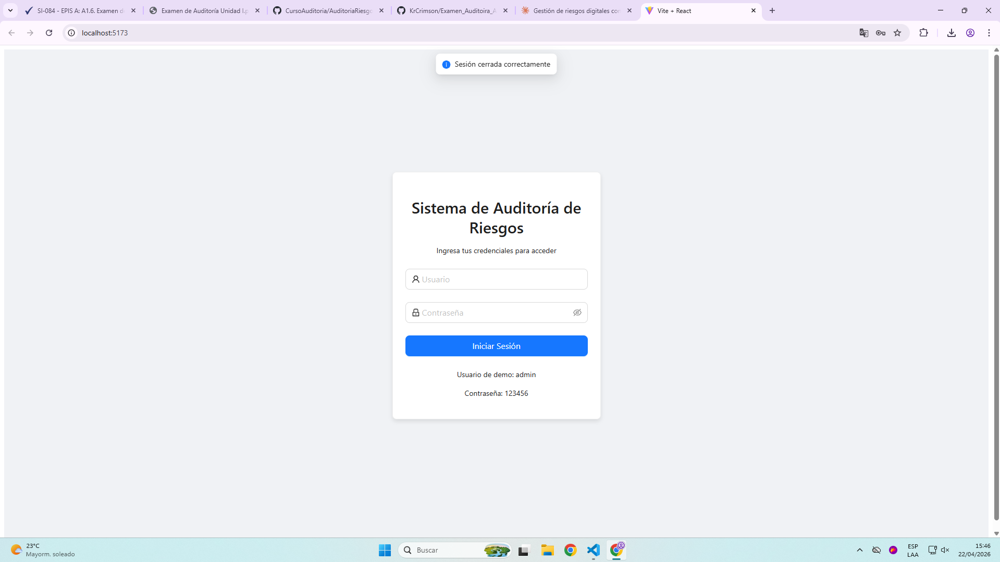
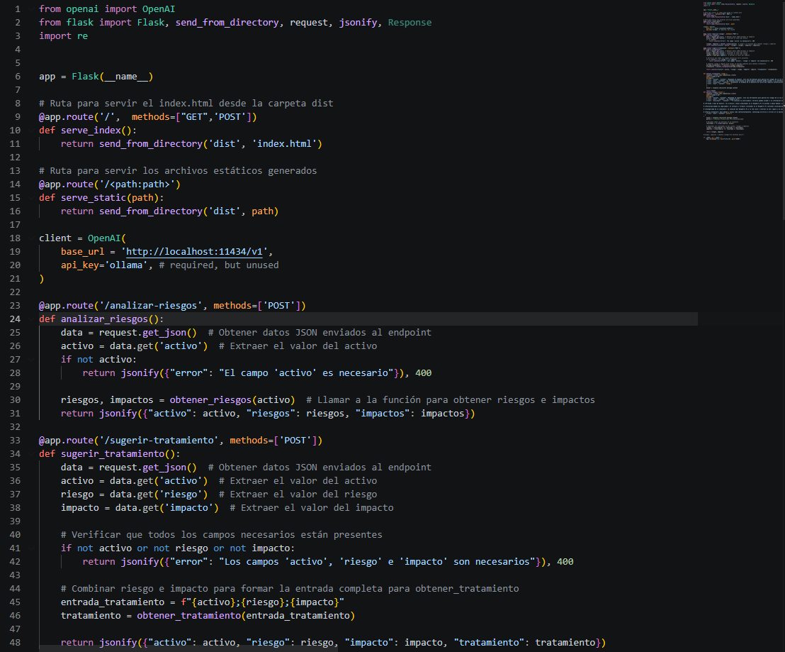
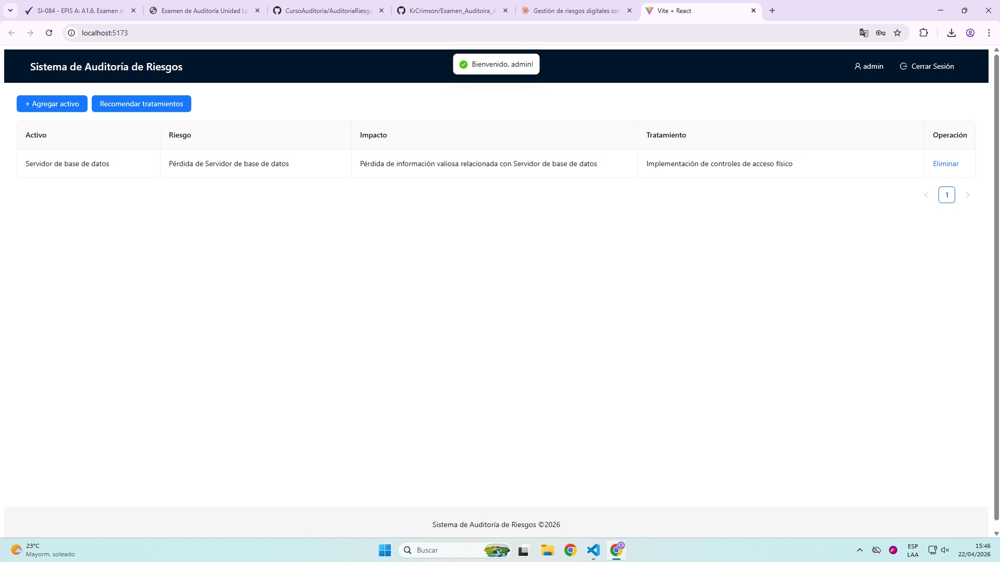
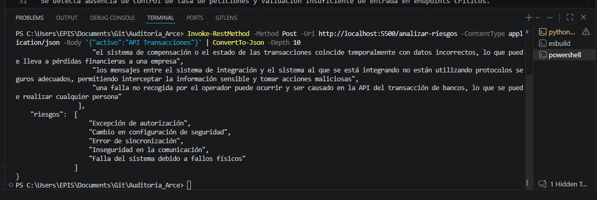
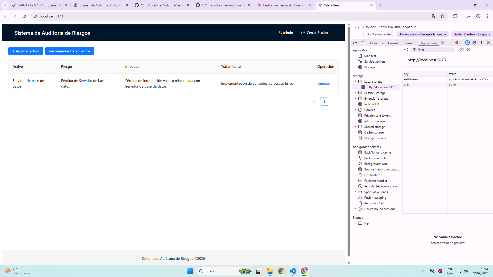
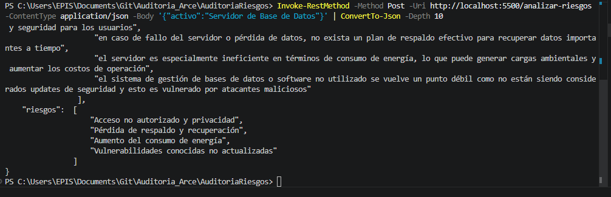
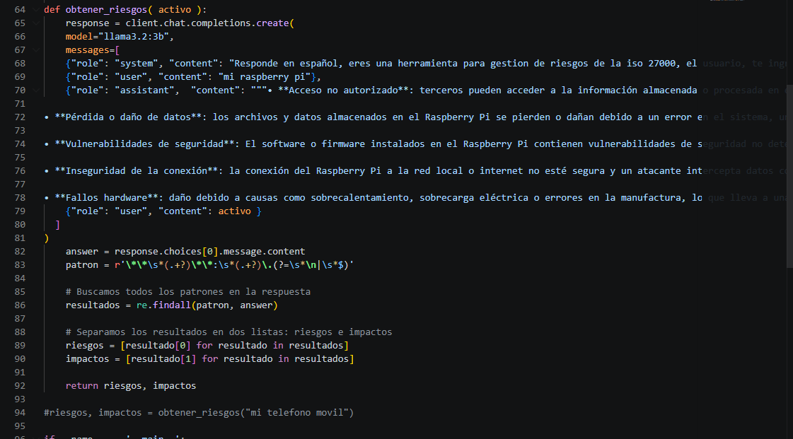
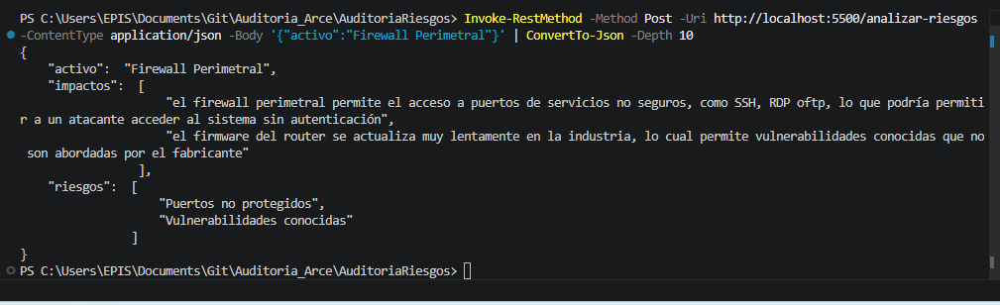
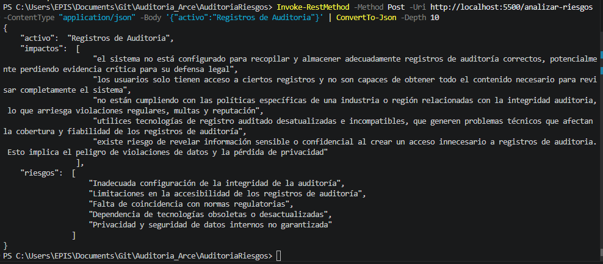

# Informe de Auditoría de Sistemas - Examen de la Unidad I

Nombres y apellidos: Sebastian Rodrigo Arce Bracamonte
Fecha: 22/04/2026
URL GitHub: https://github.com/KrCrimson/Examen_Auditoira_Arce.git

## 1. Proyecto de Auditoría de Riesgos

### Login
Evidencia:

Descripción:
Se implementó un inicio de sesión ficticio sin base de datos para controlar el acceso al sistema. La validación se realiza con credenciales de demostración y se almacena un token de sesión local en el navegador para habilitar o cerrar sesión.

### Motor de Inteligencia Artificial
Evidencia:

Descripción:
El motor de IA se ejecuta localmente mediante Ollama y se integra desde el backend Flask. A partir del activo ingresado, el sistema obtiene riesgos e impactos y propone tratamientos de mitigación alineados con controles de ISO 27001.

## 2. Hallazgos

### Activo 1: API Transacciones
Evidencia:

Condición:
Se detecta ausencia de control de tasa de peticiones y validación insuficiente de entrada en endpoints críticos.

Recomendación:
Aplicar validación estricta de entradas, protección contra abuso con rate limiting y autenticación robusta por token con expiración.

Riesgo: Probabilidad Alta

### Activo 2: Aplicación Web de Banca
Evidencia:

Condición:
La aplicación presenta riesgo de gestión de sesión débil al no exigir renovación periódica de sesión en operaciones sensibles.

Recomendación:
Implementar expiración de sesión por inactividad, rotación de token y controles de sesión segura para operaciones de alto impacto.

Riesgo: Probabilidad Alta

### Activo 3: Servidor de Base de Datos
Evidencia:

Condición:
Se observa riesgo por privilegios excesivos en cuentas de servicio y falta de evidencia de cifrado de datos en reposo.

Recomendación:
Aplicar principio de mínimo privilegio, segmentar cuentas por función y habilitar cifrado de datos en reposo con gestión segura de claves.

Riesgo: Probabilidad Alta

### Activo 4: Firewall Perimetral
Evidencia:

Condición:
Se identifica potencial exposición de servicios no esenciales por reglas permisivas y revisión no periódica del conjunto de reglas.

Recomendación:
Endurecer política por defecto, cerrar puertos innecesarios, documentar justificación por regla y ejecutar revisiones formales periódicas.

Riesgo: Probabilidad Media

### Activo 5: Registros de Auditoría
Evidencia:

Condición:
No se garantiza centralización ni retención suficiente de logs para trazabilidad completa de incidentes.

Recomendación:
Centralizar registros en una plataforma SIEM, definir retención mínima y proteger la integridad de logs con controles de acceso y monitoreo.

Riesgo: Probabilidad Media

## 3. Evidencia Técnica del Proyecto

Tecnologías implementadas:
- Frontend: React + Vite + Ant Design
- Backend: Flask
- IA local: Ollama (API compatible con OpenAI)

Evidencia sugerida para capturas:
- Pantalla de login antes de autenticación
- Pantalla principal con usuario autenticado
- Código de autenticación ficticia
- Código del backend de IA
- Resultado de análisis de riesgos
- Resultado de recomendación de tratamiento

## 4. Conclusión

La auditoría permitió identificar riesgos prioritarios en activos críticos del entorno bancario. Se definieron acciones de mitigación alineadas con buenas prácticas de seguridad e ISO 27001, priorizando controles preventivos, monitoreo y trazabilidad para reducir la probabilidad de incidentes.

